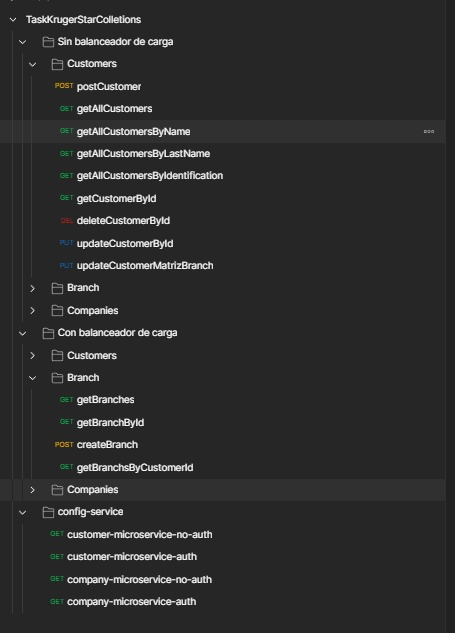

#  Construccion de una API REST 
> Tarea final de Back End contrucción completa de una API REST con estandares de desarrollo SOLID 

## Construido con 

- Spring Boot 3.0.1
- JAVA 17
- gradle
- Eureka Netflix
- Feign Client
- Resilience4j
- Spring Boot Security
- Spring Boot Gateway
- Postman
- Mockito
- Swagger
- Junit 5

## Correlo localmente

 ### Configuración

 - Clona este reposiotrio utilizando `git clone https://github.com/khebinSd/KrugerSFinalTask`
 - Es necesario tener instalado el JDK para Java 17.
 - Postman u otra herramienta como Thunder Client o Insonmia para el test de la API

 ### Pasos

 - Primero abrir el proyecto `config-microservicio`, este tiene centralizado los archivos de configruación de cada microservicio, ejectuar el proyecto con el IDE de confianza o utilizando `gradle bootrun`, se ejecutará en el puerto `8080`

 - Segundo abrir el proyecto `registry-microservicio`, este microservicio mantiene el registro de los microservicios del proyecto a manos de Eureka, ejectuar el proyecto con el IDE de confianza o utilizando`gradle bootrun`, se ejecturá en el puerto `8081`

 - Tercero abrir el proyecto `gateway-microservicio`, este microservicio se conecta con Eureka para obtener la información de los microservicios registrados e implementar, circuit breaker utilizando resilience4j y feign client además de otorgar balanceo de carga a los microservicios, ejectuar el proyecto con el IDE de confianza o utilizando `gradle bootrun`, se ejecturá en el puerto `8082`

 - Cuarto abrir el proyecto `company-microservicio`, este microservicio contiene la API  de las compañias y se conecta con el microservicio `customer-microservicio` mediante Feign client, ejectuar el proyecto con el IDE de confianza o utilizando`gradle bootrun`, se ejecturá en el puerto `9090`

 - Cuarto abrir el proyecto `customer-microservicio`, este microservicio contiene la API  de las compañias y se conecta con el microservicio `company-microservicio` mediante Feign client, ejectuar el proyecto con el IDE de confianza o utilizando`gradle bootrun`, se ejecturá en el puerto `9091`

 - Quinto para probar la API, se debe importar la colleción utilizando POSTMAN con nombre `TaskKrugerStarColletions.postman_collection` que se encuentra en la raíz del repositorio dentro de la carpeta `/resources/postman`.

 ### Documentación

  - Para probar la documentación del microservicio `customer-microservicio` utilizando swagger se ejecuta localmente en la siguiente ruta  [http://localhost:9090/swagger-ui/index.html#/](http://localhost:9090/swagger-ui/index.html#/)

  - Para probar la documentación del microservicio `company-microservicio` utilizando swagger se ejecuta localmente en la siguiente ruta  [http://localhost:9091/swagger-ui/index.html#/](http://localhost:9091/swagger-ui/index.html#/)

## 👤 Author

 **Kevin Alexander Mantilla G**

- GitHub: [@khebinSd](https://github.com/khabLexander)
- Twitter: [@Khabin14](https://twitter.com/Khabin14)
- LinkedIn: [Kevin Alexander Mantilla](https://www.linkedin.com/in/kevin-alexander-mantilla-3238a5213/)

## 🤲 Show your support

- Give me a ⭐ if you like it!